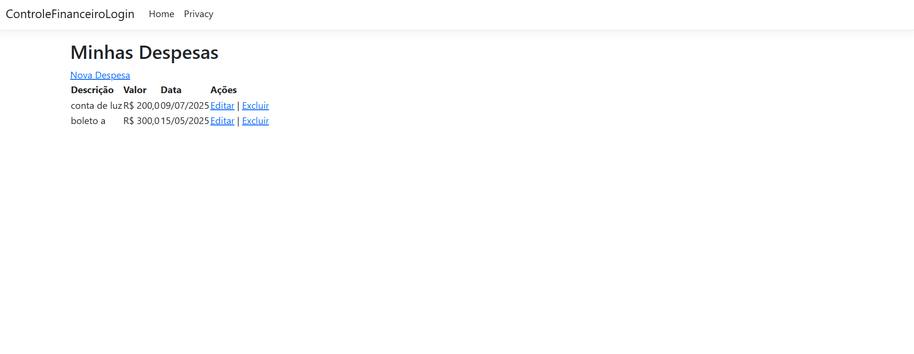

# 💰 Controle Financeiro com Login

Sistema ASP.NET Core MVC para gerenciamento de despesas pessoais com autenticação por sessão, banco de dados SQLite e CRUD completo.

## 🔧 Tecnologias

- C# com ASP.NET Core 8
- Entity Framework Core
- SQLite
- MVC + Razor Views
- Session via HttpContext

## ✅ Funcionalidades

- Cadastro e login de usuário
- CRUD de despesas
- Sessão protegida por filtro customizado
- Layout simples e funcional

## 🖼️ Captura de Tela

## 👨‍💻 Desenvolvido por

[Davi Cairo](https://github.com/dcair2024) — Projeto individual para portfólio e estudo profissional.
